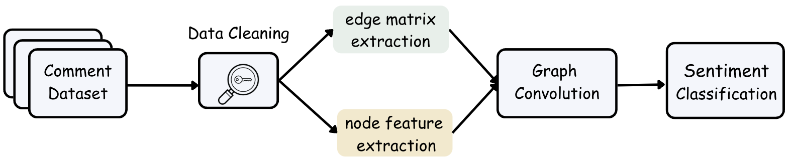
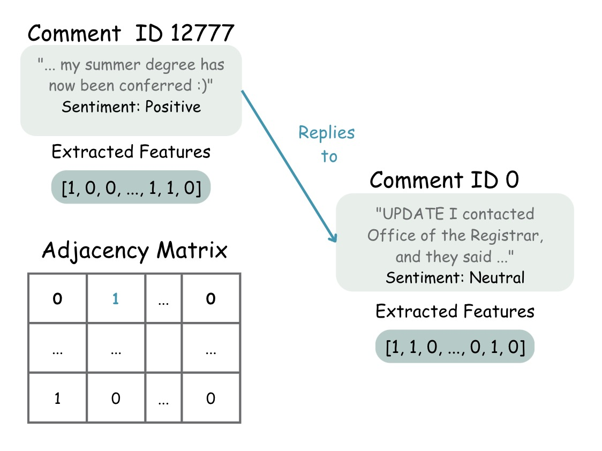
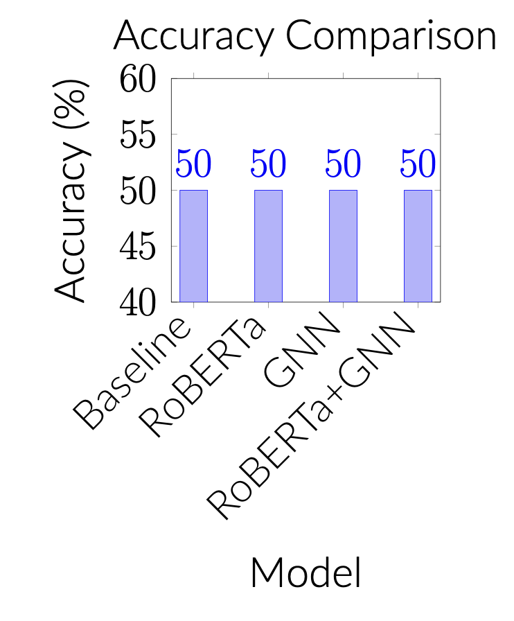

# DSC Capstone: Graph Neural Networks for Enhancing Sentiment Analysis

## Introduction:
In the dynamic realm of NLP, sentiment analysis stands as a cornerstone for unraveling the intricate emotional fabric of text. However, the traditional models often falter at the complex dance of sentiments in social media's vast expanse. This study introduces a novel confluence of Graph Neural Networks, particularly Graph Attention Networks, with the rich linguistic insights of NLP techniques such as RoBERTa. Centered on the vibrant dialogues within college SubReddit forums amid the COVID-19 period, our method transcends conventional sentiment analysis. It merges NLP's semantic depth with GNN's contextual acumen, aiming to illuminate the nuanced emotional landscape of digital discourse in these unprecedented times.

## Dataset
- Social media data from **Reddit**, focusing on SubReddits related to various colleges.
- Data from two periods: **2019 (pre-pandemic)** and **2020 (during the pandemic)**, to analyze sentiment changes due to COVID-19.
- Selection based on a mix of **private and public universities**, varying by **location size** and their approach to **in-person learning during the pandemic**.
- A total of **165,570 messages**, including original posts, comments, post replies, and comment replies.
- **Manual labeling** of a substantial subset to ensure a balanced and reliable dataset for training and testing the machine learning models, covering various sentiment categories.

## Methodolody

**RoBERTa Embedding:** For deep textual understanding, we leverage RoBERTa embeddings, enriching our analysis with nuanced language representation.

**Graph Construction:** We architect a directed graph where nodes symbolize individual comments, and edges reflect the direct interactions, forming the backbone of our analysis.

**GAT Implementation:** Utilizing TensorFlow, our GAT model dynamically assigns weights to node interactions, facilitating nuanced sentiment classification.

## Results

*Figure: Comparison of model accuracies*

The integration of GNN with RoBERTa resulted in a substantial accuracy improvement, confirming the model's efficacy in capturing complex relational dynamics and enhancing sentiment analysis. Our findings reveal the GAT-enhanced model's better performance in sentiment analysis over conventional methods.

## Discussion

Integrating GNNs with NLP technologies a new era in sentiment analysis, enriching our comprehension of text-based emotions and social interconnections. This investigation underscores the synergy between GNNs and NLP in dissecting digital communications' complexities. Our approach sheds light on the nuanced world of online sentiments, offering a groundbreaking perspective on analyzing intricate text data.
